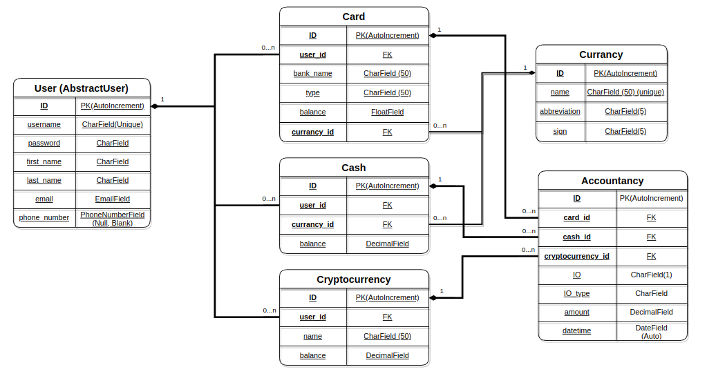

# ZLATNIC
ZLATNIC - a platform to control personal expenses.

## Check it out

[Zlatnic project deployed on Render](https://zlatnic.onrender.com/)

The project is built on a database with the following structure:


## Installation

Python3 must be already installed.

```shell
git clone https://github.com/AndriyKy/zlatnic.git
cd zlatnic
python3 -m venv venv
source venv/bin/activate
pip install -r requirements.txt
python3 manage.py loaddata zlatnic_db_data.json
python3 manage.py surserver   # start Django server
```

## Features

* Registration and authentication functionality for User
* Managing different types of wallets
* Functionality of accrual and expenditure of funds
* Monthly and monthly detailed history of financial circulation
* Powerful admin panel for advanced managing


